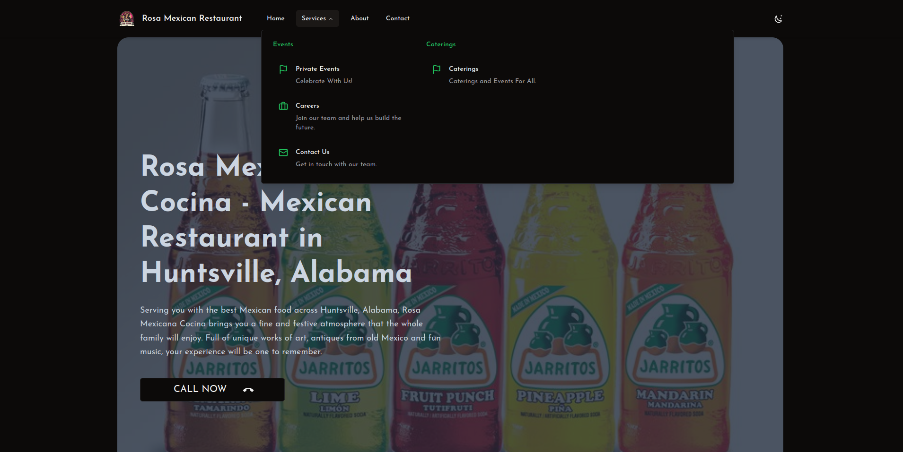
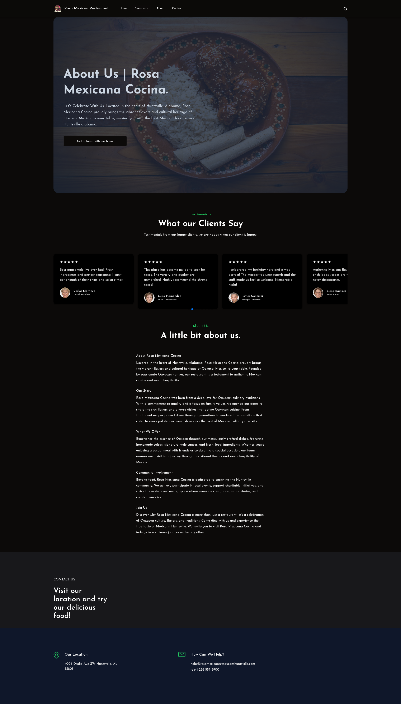

# Nuxt Monorepo using Nuxt Layers

This project demonstrates how to use [Nuxt Layers](https://nuxt.com/docs/getting-started/layers) to build a complete monorepo architecture.


## Prerequisites

- [pnpm](https://pnpm.io/)
- [Node.js](https://nodejs.org/en/)
- [Nuxt.js](https://nuxtjs.org/)
- [Nuxt Layers](https://nuxt.com/docs/getting-started/layers)


### The `site` package is the main  application, that will use the other packages as dependencies

- `@local-monorepo/ui`
- `@local-monorepo/content`
- `@local-monorepo/auth`
- `@local-monorepo/app`


## Setup

```bash
pnpm install
```

## Development

```bash
# all packages
pnpm dev

# dev Mode for the site only
pnpm site dev
```

## Production

```bash
# all packages
pnpm build

# app only
pnpm site build
```


Example use case:


1. Rosa mexican Restaurant

[Link](https://rosamexicanrestauranthuntsville.com/)
Preview:

Dark mode:


Light mode:


Menu:



Events:


About:


